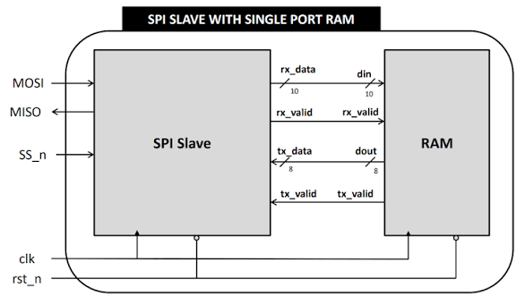
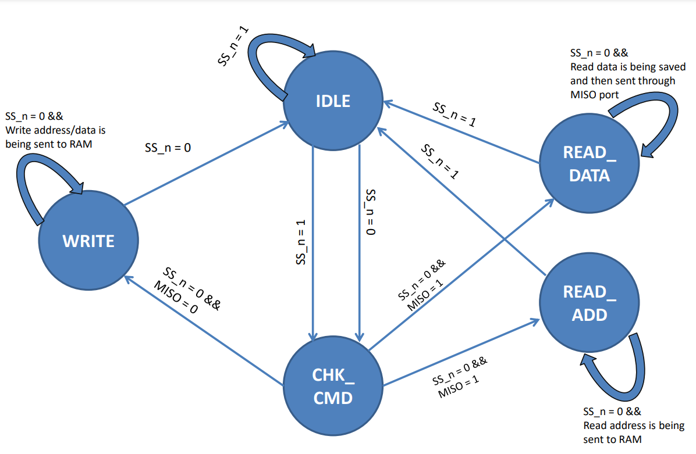

# SPI Slave with Single Port RAM

## 📌 Overview
This project implements an SPI Slave interface that acts as a communication bridge between a master device and a Single Port RAM. Designed in Verilog, the system converts serial MOSI data into a parallel format and translates commands for the RAM using a custom 2-bit command code. The design has been verified using QuestaSim and synthesized for FPGA implementation.

## 🏗️ System Architecture

The top-level module (`TOP.v`) integrates two main components:
1. **SPI Slave Module:** Receives serial commands via `MOSI`, uses `SS_n` (Slave Select) to initiate communication, and transmits stored data back to the master via `MISO`. It manages the communication flow using a Finite State Machine (FSM).
2. **Single Port RAM Module:** A synchronous memory block (256 depth x 8-bit width) that stores and retrieves data based on the parallel signals received from the SPI Slave.

## 🔌 Modules Description

### SPI Slave Module
The SPI slave module is responsible for receiving data from the master device and interacting with the RAM module. It has the following ports:

| Name | Type | Size | Description |
|---|---|---|---|
| clk | Input | 1 bit | Clock signal |
| rst_n | Input | 1 bit | Active low reset signal |
| SS_n | Input | 1 bit | Slave Select signal |
| MOSI | Input | 1 bit | Master-Out-Slave-In data signal |
| tx_data | Input | 10 bit | Transfer data output signal, Takes MOSI for 10 clock cycles and stores it in tx_data to send it to the RAM |
| tx_valid | Input | 1 bit | Indicates when tx_data is valid |
| MISO | Output | 1 bit | Master-In-Slave-Out data signal |
| rx_data | Output | 10 bit | Received data from the memory |
| rx_valid | Output | 1 bit | Indicates when rx_data is valid |

### Single Port Async RAM Module
The single port asynchronous RAM module implements a memory block with a single data port.

* **Parameters:**
  * `MEM_DEPTH` (default: 256): Depth of the memory.
  * `ADDR_SIZE` (default: 8): Size of the memory address.

| Name | Type | Size | Description |
|---|---|---|---|
| clk | Input | 1 bit | Clock signal |
| rst_n | Input | 1 bit | Active low reset signal |
| din | Input | 10 bit | Data input |
| rx_valid | Input | 1 bit | If HIGH, accepts din[7:0] to save the write/read address internally or writes a memory word depending on the most significant 2 bits din[9:8] |
| dout | Output | 8 bit | Data output |
| tx_valid | Output | 1 bit | Whenever the command is a memory read, tx_valid should be HIGH |

* The most significant bits of `din` (`din[9:8]`) determine the operation to be performed:

| Port | din[9:8] | Command | Description |
|---|---|---|---|
| din | 00 | Write | Holds din[7:0] internally as a write address |
| din | 01 | Write | Writes din[7:0] to the memory with the write address held previously |
| din | 10 | Read | Holds din[7:0] internally as a read address |
| din | 11 | Read | Reads the memory with the read address held previously. tx_valid should be HIGH, and dout holds the word read from the memory. din[7:0] is ignored |

### 🔗 Wire Connections
* `rx_data` in the SPI slave module is connected to the `din` port in the RAM module.
* `rx_valid` in the SPI slave module is connected to `rx_valid` in the RAM module.
* `dout` in the RAM module is connected to `tx_data` in the SPI slave module.
* `tx_valid` in the RAM module is connected to `tx_valid` in the SPI slave module.

## ⚙️ FSM

The communication is governed by an FSM with the following states: `IDLE`, `CHK_CMD`, `WRITE`, `READ_ADD`, and `READ_DATA`.

A critical part of this project involved analyzing different FSM encoding styles during FPGA synthesis (Xilinx Vivado) to optimize timing performance.

| Encoding Style | Setup Time Slack (WNS) | Hold Time Slack (WHS) |
|----------------|------------------------|-----------------------|
| **One-Hot**    | **5.898 ns**           | 0.139 ns              |
| Gray           | 5.445 ns               | 0.139 ns              |
| Sequential     | 5.445 ns               | 0.139 ns              |

**Conclusion:** One-Hot Encoding provided the highest Worst Negative Slack (WNS) of 5.898 ns, allowing the system to operate at the highest possible clock frequency.

## 📂 Repository Structure
* `src/` - Verilog RTL source files (`TOP.v`, `SPI_SLAVE.v`, `Ram.v`)
* `tb/` - Testbench files (`SPI_tb.v`)
* `Scripts/` - QuestaSim DO file (`DOFILE.do`) and FPGA constraints (`Constraints_basys3.xdc`)
* `docs/` - Project documentation, synthesis reports, and waveforms
* `docs/images/` - Screenshots of architecture, FSM, and simulation waveforms

## 👤 Author
**Abdelrahman Eid**
